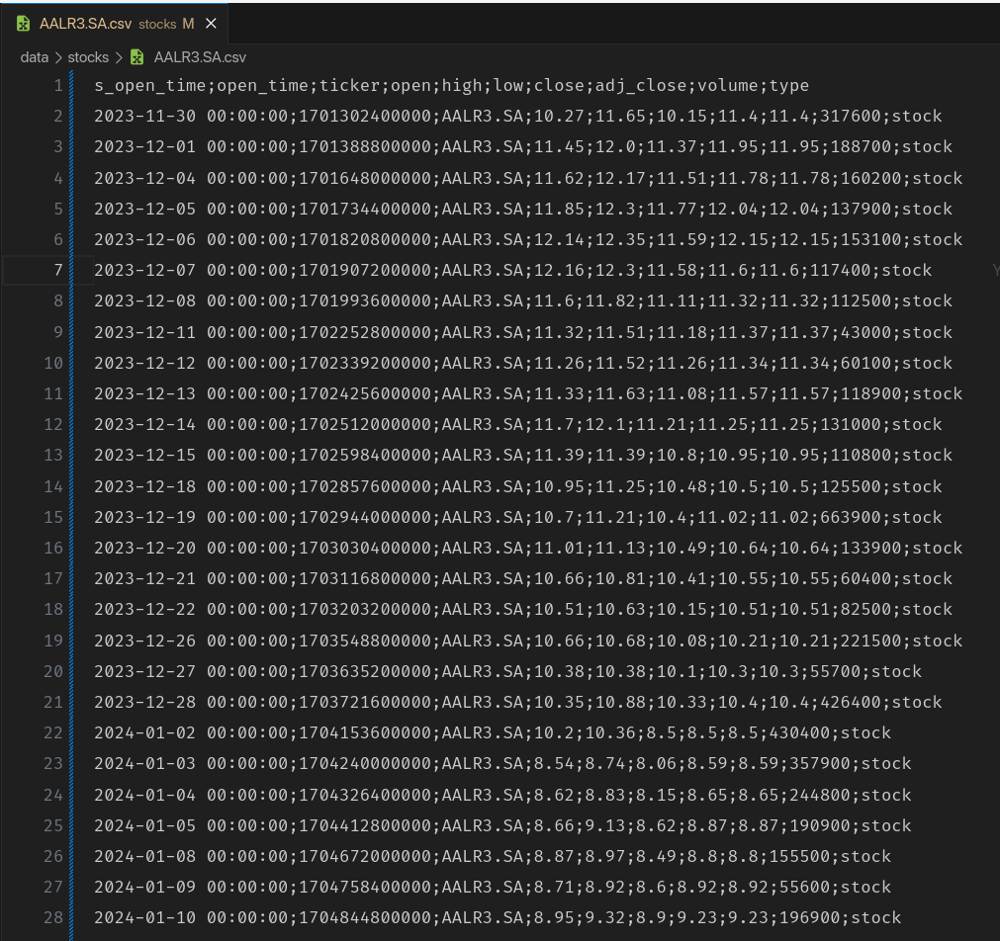

XP Educação

Relatório do Projeto Aplicado

Identificar Ações da Bovespa/B3 com sinais de alta ou queda nos preços

MARCELO LIMA GOMES

Orientador(a): Daniel Viana

Fevereiro/2024

NOME DO ALUNO

XP EDUCAÇÃO  
  
RELATÓRIO DO PROJETO APLICADO

  

  

Identificar Ações da Bovespa/B3 com sinais de alta ou queda nos preços

  

  

  
Relatório de Projeto Aplicado desenvolvido para fins de conclusão do curso MBA em Ciência de Dados.  

Orientador (a): Daniel Viana

  

  

  
  
Brasília - DF  
Fevereiro / 2024

Sumário

[1\. CANVAS do Projeto Aplicado](#h.3znysh7)        4

1.1 [Desafio](#h.4d34og8)        [5](#h.4d34og8)

[1.1.1 Análise de Contexto](#h.17dp8vu)        [5](#h.17dp8vu)

[1.1.2 Personas](#h.lnxbz9)        [6](#h.lnxbz9)

[1.1.3 Benefícios e Justificativas](#h.35nkun2)        [7](#h.35nkun2)

[1.1.4 Hipóteses](#h.1ksv4uv)        [8](#h.1ksv4uv)

[1.2 Solução](#h.2jxsxqh)        [9](#h.2jxsxqh)

[1.2.1 Objetivo SMART](#h.3j2qqm3)        [9](#h.3j2qqm3)

[1.2.2 Premissas e Restrições](#h.1y810tw)        [11](#h.1y810tw)

[1.2.3 Backlog de Produto](#h.4i7ojhp)        [13](#h.4i7ojhp)

[2\. Área de Experimentação](#h.2xcytpi)        [14](#h.2xcytpi)

[2.1 Sprint 1](#h.3as4poj)        [16](#h.3as4poj)

[2.1.1 Solução](#h.1pxezwc)        [16](#h.1pxezwc)

[Evidência do planejamento:](#h.49x2ik5)        [16](#h.49x2ik5)

[Evidência da execução de cada requisito:](#h.2p2csry)        [16](#h.2p2csry)

[Evidência dos resultados:](#h.147n2zr)        [16](#h.147n2zr)

[2.1.2 Lições Aprendidas](#h.3o7alnk)        [16](#h.3o7alnk)

[2.2 Sprint 2](#h.ihv636)        [17](#h.ihv636)

[2.2.1 Solução](#h.1hmsyys)        [17](#h.1hmsyys)

[Evidência do planejamento:](#h.41mghml)        [17](#h.41mghml)

[Evidência da execução de cada requisito:](#h.2grqrue)        [17](#h.2grqrue)

[Evidência dos resultados:](#h.vx1227)        [17](#h.vx1227)

[2.2.2 Lições Aprendidas](#h.3fwokq0)        [17](#h.3fwokq0)

[2.3 Sprint 3](#h.1v1yuxt)        [18](#h.1v1yuxt)

[2.3.1 Solução](#h.4f1mdlm)        [18](#h.4f1mdlm)

[Evidência do planejamento:](#h.2u6wntf)        [18](#h.2u6wntf)

[Evidência da execução de cada requisito:](#h.19c6y18)        [18](#h.19c6y18)

[Evidência dos resultados:](#h.3tbugp1)        [18](#h.3tbugp1)

[2.3.2 Lições Aprendidas](#h.28h4qwu)        [18](#h.28h4qwu)

[3\. Considerações Finais](#h.nmf14n)        [19](#h.nmf14n)

[3.1 Resultados](#h.1mrcu09)        [19](#h.1mrcu09)

[3.2 Contribuições](#h.111kx3o)        [19](#h.111kx3o)

[3.3 Próximos passos](#h.2zbgiuw)        [19](#h.2zbgiuw)

## 

* * *

## 

## 

## 1\. CANVAS do Projeto Aplicado

Figura conceitual, que representa todas as etapas do Projeto Aplicado.

Figura 1\. Canvas do Projeto Aplicado

1.  ## Desafio

### 1.1.1 Análise de Contexto

O aumento do interesse dos brasileiros por investimentos em renda variável, apesar do cenário de incerteza global, abre oportunidade para o desenvolvimento de mecanismos de apoio a investidores leigos, como sistemas de recomendação de ações com indicativo de alta ou queda baseado em algoritmos de inteligência artificial.

A inteligência artificial (IA) pode oferecer diversos benefícios na análise temporal de histórico de valores de ações na bolsa de valores com o intuito de prever seu comportamento futuro. Dentre eles, destacam-se:

*   Maior precisão nas previsões: A IA pode ser utilizada para identificar padrões e tendências nos dados históricos de preços de ações, o que pode ajudar a melhorar a precisão das previsões futuras.
*   Menor tempo de análise: A IA pode automatizar muitas das tarefas envolvidas na análise de dados históricos, o que pode economizar tempo e recursos para os analistas.
*   Maior capacidade de processamento de informações: A IA pode lidar com grandes quantidades de dados de forma mais eficiente do que os humanos, o que pode permitir uma análise mais completa e aprofundada.

Além disso, a IA pode ser utilizada para identificar fatores que podem influenciar o comportamento futuro dos preços das ações, como mudanças econômicas, políticas ou sociais. Isso pode ajudar os investidores a tomar decisões mais informadas e reduzir o risco de perdas.

Alguns exemplos de como a IA está sendo utilizada na análise de preços de ações incluem:

*   Modelos de aprendizado de máquina: Esses modelos são treinados em dados históricos de preços de ações para identificar padrões e tendências. Eles podem ser utilizados para prever o comportamento futuro dos preços, bem como para identificar oportunidades de investimento.
*   Mineração de dados: Essa técnica pode ser utilizada para identificar padrões e tendências ocultos nos dados históricos de preços de ações. Isso pode ajudar os investidores a identificar oportunidades de investimento que não seriam facilmente detectadas por métodos tradicionais.
*   Análise de sentimento: Essa técnica pode ser utilizada para avaliar o sentimento dos investidores em relação a uma determinada ação. Isso pode ajudar os investidores a identificar ações que estão sendo supervalorizadas ou subvalorizadas.

Ainda que a IA não seja uma garantia de sucesso no mercado de ações, ela pode ser uma ferramenta valiosa para os investidores que buscam tomar decisões mais informadas.

Figura 2\. Matriz CSD

### Para entendermos melhor como funciona o processo de análise, precisamos conhecer os indicadores que são a base do processo. Nesta proposta vamos utilizar dois indicadores classificados como Indicadores de Tendência. Estes são utilizados como  ferramentas de análise técnica que medem a força de uma tendência de preços. Eles são usados para identificar ações que estão em tendência de alta ou de baixa, e para prever se essa tendência continuará ou se inverterá.

### Os indicadores de tendência são baseados na ideia de que os preços de ações tendem a continuar a se mover na mesma direção em que estão se movendo atualmente. Por exemplo, se o preço de uma ação está subindo, é mais provável que continue subindo do que caia.

### Existem muitos indicadores de tendência diferentes, mas aqui iremos utilizar os dois mais comuns:

*   ### Média Móvel: A média móvel é uma média de preços de ações ao longo de um período de tempo específico. Uma média móvel ascendente indica que os preços estão em tendência de alta, enquanto uma média móvel descendente indica que os preços estão em tendência de baixa.

*   ### Índice de Força Relativa (RSI): O índice de força relativa (RSI) é um indicador que mede a força de uma tendência de preços. Um RSI acima de 70 indica que a tendência de alta está forte, enquanto um RSI abaixo de 30 indica que a tendência de baixa está forte.

### Os indicadores de tendência podem ser uma ferramenta útil para investidores que buscam identificar oportunidades de investimento. No entanto, é importante lembrar que estes indicadores não são infalíveis. Eles podem fornecer sinais falsos positivos e negativos, portanto, é importante usá-los em conjunto com outras ferramentas de análise técnica e fundamentalista.

### 

Figura 3\. Análise do Contexto do Problema - POEMS

* * *

### 

### 1.1.2 Personas

A persona de um investidor na bolsa de valores que utiliza ferramentas de inteligência artificial (IA) para orientar suas decisões é alguém inovador e orientado para dados. Este investidor compreende que a IA pode fornecer insights valiosos e análises preditivas, otimizando sua capacidade de tomar decisões informadas no mercado dinâmico de ações. Sua abordagem é caracterizada por uma busca contínua por eficiência e precisão, reconhecendo o potencial da IA para analisar grandes volumes de dados de maneira rápida e objetiva.

Para isso vamos definir o biotipo da persona que irá utilizar esta solução:

Nome: João

Idade: 35 anos

Profissão: Engenheiro de software

Objetivo: Aposentadoria

Motivação: Segurança financeira para sua família

Necessidade: Apoio para tomar decisões de investimento

Desafios: Falta de tempo para estudar o mercado financeiro

Preferências: Ferramentas simples e intuitivas

Exemplo:

João é um engenheiro de software de 35 anos que está se preparando para a aposentadoria. Ele tem um orçamento limitado e, portanto, precisa encontrar oportunidades de investimento que ofereçam um bom retorno com baixo risco. João tem pouco tempo para estudar o mercado financeiro, por isso procuram ferramentas que o ajudem a tomar decisões de investimento informadas de forma rápida e fácil.

João utiliza um mecanismo de recomendação de ações com sinal de alta ou queda nos preços baseado em inteligência artificial. Esse mecanismo analisa dados históricos e indicadores financeiros para identificar ações que estão sendo negociadas abaixo ou acima do seu valor intrínseco. João utiliza as recomendações do mecanismo como um ponto de partida para suas próprias análises, mas também confia na ferramenta para lhe dar uma visão geral do mercado e identificar oportunidades de investimento que ele possa ter perdido.

João está satisfeito com o mecanismo de recomendação de ações descontadas. Ele acredita que a ferramenta o ajudou a tomar decisões de investimento mais informadas e a reduzir o risco de perdas.

Figura 4\. Mapa de Empatia

* * *

### 

### 1.1.3 Benefícios e Justificativas

Ao entender os objetivos, motivações e necessidades dos investidores, podemos desenvolver produtos e serviços que atendam melhor às suas necessidades. Por exemplo, um mecanismo de recomendação de ações com sinal de alta ou queda de preços baseado na aplicação de inteligência artificial, tendo como entrada de dados a base histórica dos valores das respectivas ações e os dados de momento.

Espera-se que o resultado apresentado seja especialmente útil para o processo de análise e tomada de decisão de investidores no momento de comprar ou vender uma ação.

Podemos enumerar alguns dos benefícios que justificam a criação desta solução:

*   Facilitar a análise de dados: Os investidores têm acesso a uma grande quantidade de dados, mas pode ser difícil analisá-los de forma eficaz. Os produtos e serviços devem facilitar a análise de dados, fornecendo ferramentas e recursos visuais que ajudem os investidores a entender os dados e identificar tendências.

*   Fornecer informações relevantes: Os investidores precisam de informações relevantes para tomar decisões de investimento informadas. Os produtos e serviços devem fornecer informações precisas e atualizadas, bem como informações personalizadas que sejam relevantes para os objetivos e necessidades individuais dos investidores.

*   Ser intuitivo: Os investidores têm pouco tempo e precisam de ferramentas que sejam simples e intuitivas de usar. Os produtos e serviços devem ser fáceis de entender e usar, mesmo para investidores com pouco conhecimento do mercado financeiro.

* * *

Figura 5.Explicação da proposta de Valor

Figura 6 - Blueprint investidor

* * *

### 1.1.4 Hipóteses

Para o projeto, é possível elencar a matriz abaixo com observações e hipóteses a respeito do desafio que motiva a implementação da solução:

<table class="c79">

<tbody>

<tr class="c69">

<td class="c121" colspan="1" rowspan="1">

Observações

</td>

<td class="c141" colspan="1" rowspan="1">

Hipóteses

</td>

</tr>

<tr class="c43">

<td class="c159" colspan="1" rowspan="1">

A falta de acesso a dados históricos da B3 pode prejudicar a solução

</td>

<td class="c125" colspan="1" rowspan="1">

A B3 criou o B3 for developers com intuito de compartilhar informações via API

</td>

</tr>

<tr class="c34">

<td class="c55 c41" colspan="1" rowspan="1">

O armazenamento de dados pode ser tornar inviável pelo volume de informações

</td>

<td class="c41 c65" colspan="1" rowspan="1">

Adotar um range de dados que não impacte a média móvel a ser calculada e não inviabilize seu armazenamento

</td>

</tr>

<tr class="c71">

<td class="c55" colspan="1" rowspan="1">

As médias móveis obtidas podem induzir a investimentos não vantajosos

</td>

<td class="c65" colspan="1" rowspan="1">

As médias obtidas são tendências, não é possível garantir resultados futuros

</td>

</tr>

<tr class="c161">

<td class="c55 c41" colspan="1" rowspan="1">

Os recursos computacionais para processamento podem ser insuficientes para cálculo

</td>

<td class="c65 c41" colspan="1" rowspan="1">

Limitar análise a certos escopos de ação para validar conceitos

</td>

</tr>

</tbody>

</table>

Diante das hipóteses, pode-se criar uma matriz de priorização conforme segue:

<table class="c79">

<tbody>

<tr class="c102">

<td class="c111" colspan="1" rowspan="1">

Hipóteses

</td>

<td class="c78" colspan="1" rowspan="1">

Impacto no Projeto

</td>

<td class="c78" colspan="1" rowspan="1">

Probabilidade de sucesso

</td>

<td class="c78" colspan="1" rowspan="1">

Prioridades

</td>

</tr>

<tr class="c11">

<td class="c150" colspan="1" rowspan="1">

H1 – Consumo do serviço disponibilizado pela B3 com dados históricos

</td>

<td class="c1" colspan="1" rowspan="1">

Alta

</td>

<td class="c1" colspan="1" rowspan="1">

Alta

</td>

<td class="c1" colspan="1" rowspan="1">

Muito Alta

</td>

</tr>

<tr class="c144">

<td class="c41 c108" colspan="1" rowspan="1">

H2 - Adotar um range de dados que não impacte a média móvel a ser calculada e não inviabilize seu armazenamento

</td>

<td class="c57 c41" colspan="1" rowspan="1">

Alta

</td>

<td class="c57 c41" colspan="1" rowspan="1">

Moderado

</td>

<td class="c57 c41" colspan="1" rowspan="1">

Alta

</td>

</tr>

<tr class="c71">

<td class="c108" colspan="1" rowspan="1">

H3 – Validar cálculo das médias móveis exponenciais por períodos

</td>

<td class="c57" colspan="1" rowspan="1">

Alta

</td>

<td class="c57" colspan="1" rowspan="1">

Moderado

</td>

<td class="c57" colspan="1" rowspan="1">

Alta

</td>

</tr>

<tr class="c132">

<td class="c108 c41" colspan="1" rowspan="1">

H4 – Otimizar mecanismo de processamento para execução em tempo hábil

</td>

<td class="c57 c41" colspan="1" rowspan="1">

Moderado

</td>

<td class="c57 c41" colspan="1" rowspan="1">

Moderado

</td>

<td class="c57 c41" colspan="1" rowspan="1">

Moderado

</td>

</tr>

</tbody>

</table>

Matriz de Priorização:

<table class="c79">

<tbody>

<tr class="c102">

<td class="c33" colspan="1" rowspan="1">

Hipóteses

</td>

<td class="c33" colspan="1" rowspan="1">

Impacto

</td>

<td class="c33" colspan="1" rowspan="1">

Urgência

</td>

<td class="c33" colspan="1" rowspan="1">

Viabilidade

</td>

<td class="c33" colspan="1" rowspan="1">

Pontuação Total

</td>

</tr>

<tr class="c89">

<td class="c42" colspan="1" rowspan="1">

H1

</td>

<td class="c42" colspan="1" rowspan="1">

4

</td>

<td class="c42" colspan="1" rowspan="1">

4

</td>

<td class="c42" colspan="1" rowspan="1">

5

</td>

<td class="c42" colspan="1" rowspan="1">

13

</td>

</tr>

<tr class="c89">

<td class="c10 c41" colspan="1" rowspan="1">

H2

</td>

<td class="c10 c41" colspan="1" rowspan="1">

4

</td>

<td class="c10 c41" colspan="1" rowspan="1">

3

</td>

<td class="c10 c41" colspan="1" rowspan="1">

4

</td>

<td class="c10 c41" colspan="1" rowspan="1">

11

</td>

</tr>

<tr class="c89">

<td class="c10" colspan="1" rowspan="1">

H3

</td>

<td class="c10" colspan="1" rowspan="1">

4

</td>

<td class="c10" colspan="1" rowspan="1">

3

</td>

<td class="c10" colspan="1" rowspan="1">

4

</td>

<td class="c10" colspan="1" rowspan="1">

11

</td>

</tr>

<tr class="c89">

<td class="c10 c41" colspan="1" rowspan="1">

H4

</td>

<td class="c10 c41" colspan="1" rowspan="1">

3

</td>

<td class="c10 c41" colspan="1" rowspan="1">

3

</td>

<td class="c10 c41" colspan="1" rowspan="1">

3

</td>

<td class="c10 c41" colspan="1" rowspan="1">

9

</td>

</tr>

</tbody>

</table>

* * *

## 1.2 Solução

### 1.2.1 Objetivo SMART

Os objetivos SMART do projeto para identificação do sinal de alta ou queda no preço de ações deverão atender às seguintes expectativas:

• Específicos: Identificar de forma clara e objetiva o sinal das ações em um determinado período, caso existam.

• Mensurável: Possibilitar analisar os dados, apresentando-os de forma gráfica e tabular, para indicação das respectivas ações de forma a ser facilmente auditado e validado.

• Alcançável: É uma solução viável, conceitos consolidados de mercado e fontes de dados disponíveis (sem impedimentos legais).

• Relevante: possui bastante importância no mundo dos investimentos, tanto para o entendimento do negócio, quanto para obtenção de informações sobre investimentos.

• Temporal: Considerando que a fonte de dados está disponível e existem bibliotecas (software) que viabilizam o cálculo da dos indicadores de “tendência” RSI e Média Móvel Exponencial, entende-se que prazo de 3 sprints é viável para apresentar uma primeira versão do produto.

* * *

### 1.2.2 Premissas e Restrições

As premissas do projeto são:

*   Os dados disponibilizados através da API ‘Yahoo Finance’ ([https://finance.yahoo.co](https://www.google.com/url?q=https://finance.yahoo.com/&sa=D&source=editors&ust=1708997557899844&usg=AOvVaw3A7HatqSE3thcfprjCutzo)m) e ([https://pypi.org/project/yfinance/](https://www.google.com/url?q=https://pypi.org/project/yfinance/&sa=D&source=editors&ust=1708997557900186&usg=AOvVaw22cTwqVP8WSTVa166klL9-)),  devem continuar disponível, atualizado e acessível via API, com dados públicos e gratuitos;

*   A utilização da dados da B3 não sofrerá nenhum tipo de controle nem necessidade de autorização para divulgação das informações obtidas;

  

Limitações:  

*   Indisponibilidade de dados da B3;
*   Alto volume de dados para armazenamento;
*   Problemas de desempenho no processamento das médias móveis exponenciais.

Para tanto, elaborou-se a matriz de risco abaixo para as principais limitações identificadas:

<table class="c148">

<tbody>

<tr class="c99">

<td class="c109" colspan="1" rowspan="1">

Risco Identificado

</td>

<td class="c103" colspan="1" rowspan="1">

Impacto Potencial

</td>

<td class="c22 c152" colspan="1" rowspan="1">

Ações Preventivas

</td>

<td class="c60 c152" colspan="1" rowspan="1">

Ações Corretivas

</td>

</tr>

<tr class="c11">

<td class="c128" colspan="1" rowspan="1">

Indisponibilidade de dados da B3

</td>

<td class="c155" colspan="1" rowspan="1">

Alto

</td>

<td class="c22" colspan="1" rowspan="1">

Acompanhar a legislação sobre a disponibilidade de tais dados, bem como avaliação da B3 sobre os benefícios do serviço

</td>

<td class="c60" colspan="1" rowspan="1">

Mapear possíveis alternativas em caso de indisponibilidade da API da B3

</td>

</tr>

<tr class="c11">

<td class="c41 c128" colspan="1" rowspan="1">

Alto volume de armazenamento

</td>

<td class="c155 c41" colspan="1" rowspan="1">

Médio

</td>

<td class="c22 c41" colspan="1" rowspan="1">

Avaliar custo de hospedar uma base de dados mais robusta na nuvem

</td>

<td class="c41 c60" colspan="1" rowspan="1">

Acompanhar o tamanho da base, buscando manter o menor volume de armazenamento possível e evitar dados não utilizados

</td>

</tr>

<tr class="c145">

<td class="c128" colspan="1" rowspan="1">

Problemas de desempenho no processamento da média

</td>

<td class="c155" colspan="1" rowspan="1">

Alto

</td>

<td class="c22" colspan="1" rowspan="1">

Adotar bibliotecas estatísticas consolidadas, ver melhores práticas para implementação

</td>

<td class="c60" colspan="1" rowspan="1">

Melhoria contínua do algoritmo para cálculo da média móvel exponencial.

</td>

</tr>

</tbody>

</table>

* * *

### 

### 1.2.3 Backlog de Produto

<table class="c122">

<tbody>

<tr class="c69">

<td class="c110" colspan="3" rowspan="1">

Backlog do produto

</td>

</tr>

<tr class="c89">

<td class="c25" colspan="1" rowspan="1">

Sprint 1

</td>

<td class="c41 c61" colspan="1" rowspan="1">

Sprint 2

</td>

<td class="c41 c154" colspan="1" rowspan="1">

Sprint 3

</td>

</tr>

<tr class="c149">

<td class="c151" colspan="1" rowspan="1">

Modelar estrutura de dados para armazenamento, de forma incremental, dos dados coletados na B3

</td>

<td class="c117" colspan="1" rowspan="1">

Desenvolver processo de cálculo dos indicadores de "tendência" RSI e EMA

</td>

<td class="c28" colspan="1" rowspan="1">

Criação de Jupyter Notebook para consumo dos serviços de coleta, armazenamento e processamento dos dados.

</td>

</tr>

<tr class="c124">

<td class="c119" colspan="1" rowspan="1">

Desenvolver processo para consumo dos dados da B3

</td>

<td class="c120" colspan="1" rowspan="1">

Desenvolver processo de classificação e filtragem dos dados agrupando-os em: 1\. Ações com Sinal de Alta; 2\. Ações com Sinal de Queda;

</td>

<td class="c116" colspan="1" rowspan="1">

Desenvolver apresentação dos dados classificados e agrupados através de gráficos

</td>

</tr>

<tr class="c102">

<td class="c140" colspan="1" rowspan="1">

Desenvolver processo de tratamento e armazenamento incremental dos dados

</td>

<td class="c127" colspan="1" rowspan="1">

</td>

<td class="c118" colspan="1" rowspan="1">

Agrupar as apresentações dos gráficos em: 1\. Ações com Sinal de Alta; 2\. Ações com Sinal de Queda;

</td>

</tr>

</tbody>

</table>

* * *

# 2.        Área de Experimentação

## 2.1 Sprint 1

### 2.1.1 Solução

Foco da sprint 1 foi implementar solução de software para consumo, baixa e armazenamento dos dados.

*   #### Evidência do planejamento:

*   #### Evidência da execução de cada requisito:

IB1: Modelar estrutura de dados para armazenamento, de forma incremental, dos dados coletados na B3

IB2: Desenvolver processo para consumo dos dados da B3

IB3: Desenvolver processo de tratamento e armazenamento incremental dos dados

*   #### Evidência dos resultados:

### 2.1.2 Lições Aprendidas

*   A API “Yahoo Finance” é instável. Deve-se implementar tratamento de falha no processo de download.

*   Deve-se atentar ao parâmetro “interval” e setá-lo com “1d” para trazer dados consolidados dia-a-dia e não em um intervalo de tempo diferente.

*   O campo “Open_Time” recuperado da API Yahoo Finance vem em um formato “Long Int”. Deve se converter utilizando a biblioteca pandas.to_datetime.

* * *

## 2.2 Sprint 2

### 2.2.1 Solução

*   #### Evidência do planejamento:

* * *

*   #### Evidência da execução de cada requisito:

IB4: Desenvolver processo de cálculo dos indicadores de "tendência" RSI e EMA:

* * *

IB5: Desenvolver processo de classificação e filtragem dos dados agrupando-os em: 1\. Ações com Sinal de Alta; 2\. Ações com Sinal de Queda:

* * *

*   #### Evidência dos resultados:

Ticket: AALR3

### 2.2.2 Lições Aprendidas

*   O cálculo da Média Móvel Exponencial é suportada de forma nativa na biblioteca Pandas do Python ([https://pandas.pydata.org](https://www.google.com/url?q=https://pandas.pydata.org&sa=D&source=editors&ust=1708997557912223&usg=AOvVaw0BkpQRtX9w2uHyHPHW6Ghz)) através da função “ewm” ([https://pandas.pydata.org/docs/reference/api/pandas.DataFrame.ewm.html](https://www.google.com/url?q=https://pandas.pydata.org/docs/reference/api/pandas.DataFrame.ewm.html&sa=D&source=editors&ust=1708997557912649&usg=AOvVaw1Dnb5hF3XHTqkLNlA9wg19))  sem a necessidade de implementação de novas rotinas de forma “manual” e ela trás uma performance superior, pois não itera todo o dataset de forma sequencial, usando calculo vetorial.

    * * *

## 2.3 Sprint 3

### 2.3.1 Solução

*   #### Evidência do planejamento:

* * *

#### 

*   #### Evidência da execução de cada requisito:

IB6: Criação de Jupyter Notebook para consumo dos serviços de coleta, armazenamento e processamento dos dados.

IB9: Agrupar as apresentações dos gráficos em: 1\. Ações com Sinal de Alta; 2\. Ações com Sinal de Queda;

IB7: Desenvolver apresentação dos dados classificados e agrupados através de gráficos

*   #### Evidência dos resultados:

Cálculo consolidado de todos os tickets marcados com indicativo de queda ou alta:

Exemplo do cálculo realizado para o ticket GOLL4:

### 2.3.2 Lições Aprendidas

A API Yahoo Finance continua apresentando instabilidade, e quando apresenta erro é necessário aguardar que ela retorne a estabilidade para executar as rotinas de cálculo.

* * *

# 

# 3. Considerações Finais

## 3.1 Resultados

Este projeto aplicado foi planejado e construído em 3 fases (sprints) onde a meta foi construir uma solução onde se obtém dados históricos e reais de Ações listadas na Bolsa de Valores de São Paulo (B3) e, por meio de cálculos matemáticos, aponte ações com indicativo de alta e indicativo de queda. A base de dados é consumida através de uma API Open Source chamada Yahoo Finance escrita na tecnologia Python.

O projeto atingiu seu objetivo, destacando aprendizados relevantes durante sua execução, incluindo:

*   O uso da tecnologia “Jupyter Notebooks” para desenvolver soluções facilitou tanto o desenvolvimento quanto a reprodução das etapas de execução, proporcionando um entendimento mais claro do processo.
*   A biblioteca pandas do Python oferece recursos valiosos para a manipulação e análise de dados, tornando a adoção de outras linguagens uma possível fonte de desafios já abordados eficientemente pelo Python.
*   Com a aplicação de um armazenamento de dados e uma estrutura de dados simples utilizando a biblioteca pandas (já citada) a manipulação da informação para aplicação dos cálculos foi facilitada.
*   A escolha de fontes de dados Open Source foi aplicada para esta prova de conceito com intuito de demonstração.

Durante a execução do projeto, enfrentou-se desafios significativos, incluindo a complexidade e burocracia na obtenção de dados históricos diretamente da B3\. Além disso, houve dificuldades ao acessar dados históricos do Yahoo Finance, já que o serviço retornava informações de um símbolo por vez, exigindo a criação de um mecanismo paralelo para coletar dados de múltiplos símbolos sem intervenção manual.

Por fim, o cálculo e validação de indicadores revelaram-se problemáticos, apesar do suporte da biblioteca de pandas e de referências disponíveis online, devido à natureza não trivial do tema e à sua validação dispendiosa.

*   Arquivos “Jupyter Notebooks” para execução:

*   Fluxo de execução:

*   Repositório git do projeto: [https://github.com/marcelolimagomes/xpe_projeto_aplicado](https://www.google.com/url?q=https://github.com/marcelolimagomes/xpe_projeto_aplicado&sa=D&source=editors&ust=1708997557917309&usg=AOvVaw0FwISXqcmpU8kGf3BSQqYl) 

    * * *

## 3.2 Contribuições

O projeto contribui de maneira significativa em dois aspectos principais. Em primeiro lugar, oferece uma explicação abrangente dos indicadores básicos do mercado financeiro, como a MME e o RSI, visando apresentar seus conceitos e aplicabilidade na análise de tendências no mundo dos investimentos.

A expectativa é que, com essas informações, investidores leigos possam avaliar os resultados fornecidos pela solução e tomar decisões informadas sobre seus investimentos.Além disso, destaca-se a implementação de uma solução transparente e sem custos para apoiar a tomada de decisões relacionadas a investimentos.

Enquanto ferramentas de mercado e corretoras normalmente cobram taxas fixas, variáveis ou uma combinação de ambas pelos serviços prestados, a solução proposta oferece uma alternativa acessível. Com essa abordagem, os investidores têm a oportunidade de avaliar suas opções de investimento sem a necessidade de pagar taxas de corretagem para as transações realizadas sem intermédio de uma corretora de ações.

## 3.3 Próximos passos

Os próximos passos sugeridos para a evolução da solução incluem a incorporação de novos indicadores, com o objetivo de destacar suas fórmulas, interpretações e cenários associados. Isso proporcionará aos usuários da aplicação a capacidade de avaliar corretamente os resultados e obter um entendimento completo dos indicadores utilizados.

Alguns exemplos de indicadores que podem ser integrados à solução abrangem o P/L (preço/lucro), P/VPA (preço atual da ação e valor patrimonial por ação), PSR (índice de preços sobre vendas), CFS (fluxo de caixa por ação), entre outros. Essa expansão visa enriquecer a análise oferecida pela solução, proporcionando uma compreensão mais abrangente e aprofundada do desempenho dos investimentos.

* * *

REFERÊNCIAS

[1] “Número de investidores na B3 cresce mesmo em cenário de alta volatilidade”, [Número de investidores na B3 cresce mesmo em cenário de alta volatilidade](https://www.google.com/url?q=https://www.b3.com.br/pt_br/noticias/numero-de-investidores-na-b3-cresce-mesmo-em-cenario-de-alta-volatilidade.htm&sa=D&source=editors&ust=1708997557918698&usg=AOvVaw0U55Roz_-zBFEpMJiQfyUD).

[2] “Quer saber quais as ações mais baratas da bolsa”, [Veja quais são as ações mais baratas da Bolsa - Toro Investimentos Blog](https://www.google.com/url?q=https://blog.toroinvestimentos.com.br/bolsa/acoes-baratas%23:~:text%3DQuando%2520os%2520analistas%2520dizem%2520que,est%25C3%25A1%2520refletindo%2520o%2520valor%2520real&sa=D&source=editors&ust=1708997557919018&usg=AOvVaw082dOAwkIT4FuCBeUFV3wN).

[3] “Mercado de assessoria de investimento: como entrar e se especializar na área”. [Assessor de Investimentos Financeiros: quais as tendências do mercado de assessoria e como se especializar na área?](https://www.google.com/url?q=https://blog.xpeducacao.com.br/mercado-assessoria-de-investimentos/%23:~:text%3DSegundo%2520a%2520Ancord%2520(Associa%25C3%25A7%25C3%25A3o%2520Nacional,%25C3%25A1rea%2520entre%25202021%2520e%25202022&sa=D&source=editors&ust=1708997557919344&usg=AOvVaw0sfPprMPfUreXLTosywbk8)

[4] “Abertura de mais de 5 mil vagas provoca corrida para ser assessor de investimento. [Abertura de mais de 5 mil vagas provoca corrida para ser assessor de investimentos - Estadão](https://www.google.com/url?q=https://www.estadao.com.br/economia/abertura-de-mais-de-5-mil-vagas-provoca-corrida-para-ser-assessor-de-investimentos/&sa=D&source=editors&ust=1708997557919692&usg=AOvVaw123emYL16XGdpisgdzYUZq).

[5] “o que é média móvel, o indicador usado por traders”, [Média Móvel: o que é o indicador usado por traders](https://www.google.com/url?q=https://exame.com/invest/guia/o-que-e-media-movel-o-indicador-usado-por-traders/&sa=D&source=editors&ust=1708997557919952&usg=AOvVaw1zX4tMKih6CInlrfstV-07).

[6] “Médias Móveis – Aprenda como utilizar as médias móveis para auxiliar suas operações, [Médias móveis - Aprenda como utilizar as médias móveis para auxiliar suas operações](https://www.google.com/url?q=https://dvinvest.com.br/aprenda/blog/medias-moveis-aprenda-como-utilizar-as-medias-moveis-para-auxiliar-suas-operacoes%23:~:text%3DM%25C3%25A9dia%2520M%25C3%25B3vel%2520Exponencial%2520(MME)%2520%252D,do%2520pre%25C3%25A7o%2520de%2520uma%2520a%25C3%25A7%25C3%25A3o&sa=D&source=editors&ust=1708997557920347&usg=AOvVaw3_ojZ5ThEtMT4MhVCHqrAS).

[7] “O que é o indicador RSI e como ele pode te ajudar a investir melhor”. [O Que É o Indicador RSI e Como Ele Pode Te Ajudar a Investir Melhor - Blog NovaDax](https://www.google.com/url?q=https://www.novadax.com.br/entendendo-criptomoedas/o-que-e-o-indicador-rsi-e-como-ele-pode-te-ajudar-a-investir-melhor/%23:~:text%3DO%2520Indicador%2520RSI%2520%25C3%25A9%2520uma%2520das%2520melhores%2520formas%2520de%2520analisar,significa%2520%25C3%258Dndice%2520de%2520For%25C3%25A7a%2520Relativa&sa=D&source=editors&ust=1708997557920747&usg=AOvVaw3Suthu1jBjjSKwJ44S0O9g).

[8] “O que é taxa de corretagem? Por que você deve prestar atenção nisso”. [O que é taxa de corretagem? Por que você deve prestar atenção nisso?](https://www.google.com/url?q=https://blog.xpeducacao.com.br/o-que-e-taxa-de-corretagem/&sa=D&source=editors&ust=1708997557921024&usg=AOvVaw0LcP1qD8NZvUBuGSycxhq5).

